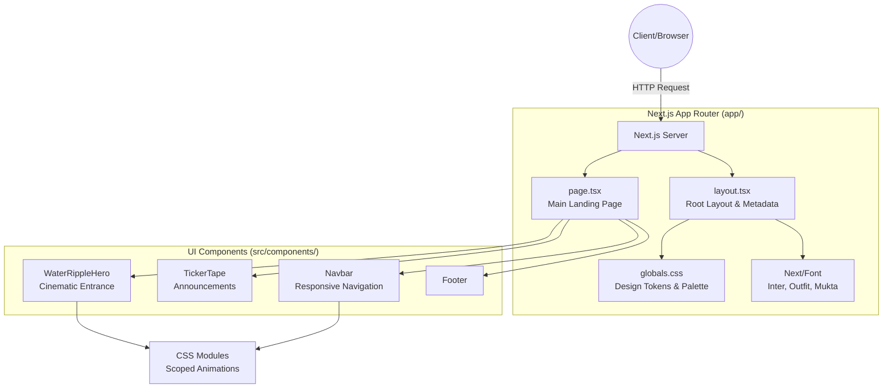

# 🏫 Shree Narayan Madhyamik Vidyalaya - Official Website


The official digital presence for **Shree Narayan Madhyamik Vidyalaya**, providing quality education from ECD to Grade 12 in Ishworpur Municipality, Sarlahi, Nepal. 

This project is built with a focus on premium aesthetics, high performance, and robust typography support (specifically for Devanagari scripts), ensuring a world-class experience for students, parents, and faculty.

---

## ✨ Features

- **Premium Cinematic UI:** Features a high-end, responsive design utilizing a warm Navy & Gold palette reflecting authority and excellence.
- **Cinematic Hero Section:** Custom-built Ken Burns style image zoom with staggered, word-by-word Devanagari text reveals and dynamic letterboxing.
- **Flawless Typography:** Native support for rendering complex Devanagari conjuncts via the `Mukta` and `Tiro Devanagari Hindi` Google Fonts.
- **Performance First:** Built on Next.js 14 App Router, utilizing Server Components for optimal load times and SEO.
- **Interactive Components:** Includes smooth scrolling, custom CSS animations, frosted glass (glassmorphism) navigation, and infinite ticker tapes.

---

## 🏗️ Architecture

The application follows a modern Next.js 14 App Router structure.



---

## 📂 Project Structure

```text
SNSS-Official-Website/
├── public/                 # Static assets (images, logos)
│   ├── mountain.jpg        # Hero background
│   └── logo.jpg            # School crest
├── src/
│   ├── app/                # Next.js App Router
│   │   ├── layout.tsx      # Root HTML shell & fonts
│   │   ├── page.tsx        # Homepage content
│   │   ├── globals.css     # CSS Variables & Resets
│   │   └── page.module.css # Homepage specific styles
│   └── components/         # Reusable React components
│       ├── WaterRippleHero # Custom hero section
│       ├── Navbar          # Main navigation
│       ├── TickerTape      # Top announcement bar
│       └── Footer          # Site footer
├── package.json            # Project dependencies
└── next.config.mjs         # Next.js configuration
```

---

## 🚀 Getting Started

### Prerequisites
- Node.js 18.17 or later
- npm, yarn, pnpm, or bun

### Installation

1. **Clone the repository**
   ```bash
   git clone https://github.com/dedsecpy/SNSS-Official-Website.git
   cd SNSS-Official-Website
   ```

2. **Install dependencies**
   ```bash
   npm install
   ```

3. **Run the development server**
   ```bash
   npm run dev
   ```

4. **View the application**
   Open [http://localhost:3000](http://localhost:3000) with your browser to see the result.

---

## 🎨 Design System

The site utilizes a custom CSS-variable based design system tailored for a premium educational institution:

- **Primary:** Deep Warm Navy (`#0B1D32`) - Represents authority and trust.
- **Accent:** Vibrant Gold (`#D4953A`) - Represents excellence and achievement.
- **Typography:** `Outfit` (Headings), `Inter` (Body), `Mukta` (Devanagari).

---

## 📄 License & Copyright

&copy; {Current Year} Shree Narayan Madhyamik Vidyalaya. All rights reserved.
